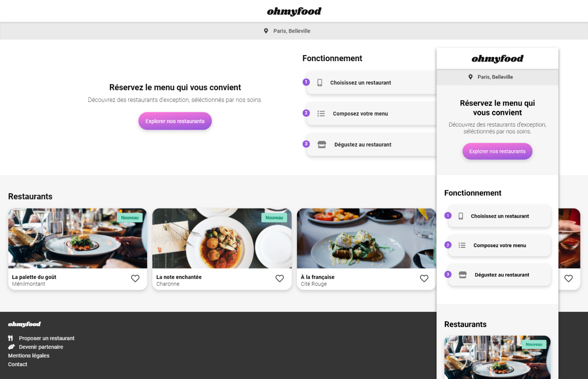

# ohmyfood
## Third project with Openclassrooms

The idea was to integrate, then animate a web page with the mobile first approach, without JavaScript.

### Challenges 

* Develop a site offering the menu of 4 major Parisian restaurants.
* Allow online reservations and menu composition.

## Preview 

## Technologies

The development will have to be done in CSS, without JavaScript.
* No framework should be used, however the use of SASS would be a
more.
* No CSS code should be applied via a style attribute in an HTML tag.

## Animations 

#### Buttons
* On hover, the background color of the main buttons should lighten slightly.
The drop shadow will also need to be more visible.
* Eventually, visitors will be able to save their favorite menus. For that, a
"Like" button in the shape of a heart is present. At the click, it will have to be
gradually fill. For this first version, the effect may appear at
hover on desktop instead of click.

#### Home page
* When the application has more menus, a “loading spinner” will be necessary. On
this model, we want to have a preview. It should appear for 1 to
3 seconds when you get to the home page, cover the entire screen, and
use CSS animations (no library). The design of this loader is not defined,
any proposal is therefore welcome as long as it is consistent with the charter
site graphics.

#### Menu pages
* On arrival on the page, the dishes should appear gradually with a slight
time lag. They can either appear one by one or by group
"Starter, main course and dessert". An example of the expected effect is provided.
* Visitors can add the dishes they want to their order by clicking on them.
This brings up a small check mark to the right of the dish. This checkmark should slide from
right to left. For this first version, the effect may appear on hover
on desktop instead of the click. If the title of the dish is too long, it should be trimmed with
ellipsis. An example of the expected effect is provided.

## Details

#### Fonts:

Logo & titles: Shrikhand / Text: Roboto.

#### Colors:

Primary: # 9356DC / Secondary: # FF79DA / Tertiary: # 99E2D0.

